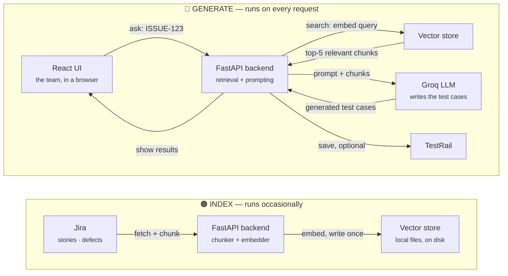

# What's under the hood of the Test Engineering RAG Platform

*Internal technical overview*

A plain-language walkthrough of every tool in the stack — what it is, why it was
chosen over the obvious alternative, and what it would cost to swap out. Written
to be read once and then handed to teammates.

**Stack size:** ~12 components · **Hosting:** runs locally, no cloud infra required ·
**External services:** Jira · TestRail · Groq

---

## 01 — What this actually is

### A tool that reads Jira, remembers it, and writes tests

The platform pulls user stories and defects out of Jira, converts them into a
searchable local index, and uses that index — plus a language model — to draft
test cases, which can then be pushed into TestRail. The "RAG" in the name stands
for **Retrieval-Augmented Generation**: before the AI writes anything, the system
retrieves the most relevant background material and hands it over first, instead
of asking the AI to work from memory alone.

> **In one sentence** — It separates **reading Jira** (slow, done occasionally)
> from **writing tests** (fast, done constantly), so every test-generation request
> works off a local, searchable copy of your project's history instead of calling
> out to Jira every single time.

**Amber (index)** — the indexing path: Jira is read, chunked, and embedded into the
local vector store. This runs occasionally (on demand or on a schedule), not per
request.
**Teal (generate)** — the generation path: every test-generation request searches
the already-built vector store, sends only the relevant pieces to the LLM, and
returns test cases. No Jira call happens in this path.

---

## 02 — Quick reference

### The stack, at a glance

The table to screenshot for the team chat.

| Layer | Tool | Role |
|---|---|---|
| Backend API | `FastAPI (Python)` | Serves the REST API, orchestrates sync + retrieval + generation |
| Frontend | `React + TypeScript` | The dashboard the team uses — sync, search, generate, review |
| Styling | `Tailwind CSS` | Design system for the dashboard UI |
| Vector store | `Custom (numpy + files)` | Stores and searches the "fingerprints" of every Jira issue |
| Embedding model | `fastembed — bge-small-en-v1.5` | Turns text into the searchable fingerprint (runs locally, no API) |
| Generation model | `Groq — Llama 3.3 70B` | Reads the retrieved context and writes the test cases |
| Jira access | `REST API v3 (or MCP)` | Pulls stories, defects, and their fields into the pipeline |
| TestRail access | `REST API (or MCP)` | Pushes generated test cases into the right project/section |
| Sync engine | `Custom, hash-based` | Detects what changed in Jira so we don't re-index everything |

---

## 03 — Application layer

### Backend & frontend

The parts of the system that would look familiar even without any AI involved.

#### `FastAPI` — Python · REST API

The backend is a Python web service. It exposes endpoints like `/api/sync/full`
and `/api/rag/generate-tests` that the dashboard calls. FastAPI was picked because
it's the standard choice for Python APIs that need to be fast to build and easy
for a small team to maintain — it auto-generates interactive API docs (visible at
`/docs`) and validates every request/response shape automatically via Pydantic.

> **Nothing unusual here** — this is a conventional choice, not an AI-specific
> one. Any Python-fluent engineer can read and extend it.

#### `React + TypeScript` — Frontend · dashboard

The four tabs the team actually uses — Sync, Vector DB, RAG Explorer, Test
Generation — are a single-page React app. TypeScript catches a category of bugs
(wrong field name, wrong shape of data from the API) before they reach a user.
Styling is done with Tailwind CSS, a utility-first system that keeps the visual
design consistent without hand-writing a separate stylesheet per component.

> **Worth knowing:** the *RAG Explorer* tab exists specifically so anyone can see
> exactly what text was retrieved and what prompt was actually sent to the LLM —
> it's the debugging window into the whole system.

---

## 04 — The memory

### Vector store — how "search by meaning" works

Traditional search matches keywords. This system needs to match *meaning* —
"login fails" should find "user cannot authenticate" even though they share
almost no words. That requires converting text into numbers first (see
*Embedding model* below), then storing and searching those numbers. That
storage-and-search layer is the vector store.

#### `Custom local store` — numpy array + JSON metadata, on disk

Rather than running a separate database process, this project stores every
issue's fingerprint as rows in a single file (`vectors.npy`) with a matching
metadata file (`metadata.jsonl`). Searching means comparing the query's
fingerprint against every stored row — at this scale (a few thousand issues)
that takes about **2 milliseconds**, measured on this machine, with no server to
install or keep running.

> **Why not a "real" database?** Below about 50,000–100,000 stored chunks, a
> proper vector database buys you nothing this project needs — no concurrent
> multi-user writes, no need to scale past one machine. It would add a service
> to install, configure, and keep alive for no measurable benefit yet.

| Option | What it is | Best fit |
|---|---|---|
| **This project** *(in use)* | Hand-built file store (numpy + JSON) | Single machine, <50k chunks, zero ops overhead |
| ChromaDB | Embedded vector database, the most common starter choice | Similar scale, but wants a proper query API and metadata filters out of the box |
| pgvector | A vector-search extension for Postgres | Teams already running Postgres who want vectors alongside normal relational data |
| Qdrant / Weaviate | Purpose-built vector database servers | Real concurrency, millions of vectors, multiple applications sharing one store |
| Pinecone | Fully managed, cloud-hosted vector database | No infrastructure to run at all, in exchange for a recurring bill and data leaving your network |

---

## 05 — The fingerprint

### Embedding model — turning text into searchable numbers

This is the single most important — and most fragile — piece of the system. Get
it wrong and every search result degrades silently: nothing crashes, the numbers
just stop meaning anything.

#### `fastembed — BAAI/bge-small-en-v1.5` — runs locally · 384-dimension fingerprint · no API key

Every issue and every search query gets converted into a list of 384 numbers by
this model. Two pieces of text with a similar *meaning* produce similar number
lists, which is what makes semantic search possible. `fastembed` runs the model
directly inside the Python process using ONNX (a lightweight format for running
trained models) — there's no server to start, no network call, and no
per-request cost.

> **The one hard rule:** changing this model invalidates every stored
> fingerprint — old and new fingerprints aren't comparable, the way a ruler in
> centimeters can't be compared to one in inches. The system now detects a
> mismatch automatically and blocks searches until a full re-index runs, rather
> than quietly returning meaningless results.

| Option | What it is | Trade-off |
|---|---|---|
| **fastembed** *(in use)* | Local, in-process, no server | Free, private, works offline — slightly lower ceiling on quality than the largest hosted models |
| Ollama + nomic-embed-text | Local, but needs its own background server running | What this project used originally — dropped because a required server that silently wasn't running is exactly how this system's biggest bug happened |
| OpenAI text-embedding-3 | Hosted, called over the API | Strong quality, but Jira content leaves the network and every embed costs money per call |
| Cohere Embed / Voyage AI | Hosted, purpose-built for retrieval quality | Similar trade-off to OpenAI — better for larger, quality-sensitive corpora |

---

## 06 — The writer

### Generation model — the one that writes the actual test cases

This is a completely separate model from the embedding one above, and that
separation matters: swapping this model is a one-function change with zero
effect on the stored vector data.

#### `Groq — Llama 3.3 70B` — hosted API · OpenAI-compatible

Once the relevant Jira context has been retrieved, it's assembled into a prompt
and sent to Groq, which serves the open-source Llama 3.3 model at very high
speed and low cost. The model reads the target issue plus a handful of related
issues, then returns test cases as structured JSON — title, steps, expected
result, priority, type.

> **Freely swappable:** Claude, GPT, or Gemini can replace Groq with a change
> confined to one function. None of them requires touching the vector store, the
> sync engine, or anything upstream — generation and retrieval are intentionally
> decoupled.

| Option | What it is | Why you'd switch |
|---|---|---|
| **Groq** *(in use)* | Hosted inference of open models (Llama, etc.) | Very fast, very cheap — good fit while output volume is high and stakes are moderate |
| Anthropic Claude | Sonnet / Opus / Haiku family | Stronger reasoning on ambiguous or thin requirements — worth it when test quality matters more than cost |
| OpenAI GPT | GPT-4-class models | Comparable case to Claude; often chosen for existing OpenAI tooling in a team |
| Google Gemini | Gemini model family | Strong fit if the org is already standardized on Google Cloud |

---

## 07 — Talking to Jira & TestRail

### Two ways in, two ways out

Both integrations support a direct REST connection or an MCP server — a newer
standard protocol for connecting AI tools to external systems. Either works; MCP
is optional infrastructure, not a requirement.

#### `Jira REST API v3` — reads · email + API token

Pulls stories and bugs, along with summary, description, acceptance criteria,
priority, and status. This is the only path in — nothing else touches Jira.

#### `TestRail REST API` — writes · username + API key

Takes a generated set of test cases and creates them in the configured project
and section. Entirely optional — the system generates and displays test cases
fine with this switched off, for teams that just want to review and copy
manually.

---

## 08 — Keeping the index fresh

### Sync engine — why it doesn't re-read everything every time

A full sync reads every story and defect once. Every sync after that is
**incremental**: it asks Jira only for issues updated since the last run, then
compares a content hash against what's already stored — if the hash matches, the
issue is skipped entirely rather than re-embedded.

Chunking is field-aware: description, acceptance criteria, and comments are
split as separate pieces rather than concatenated into one blob, and every piece
is prefixed with the issue key and summary so it stays identifiable on its own
once it's stored.

---

## 09 — Walking through one request

### What happens when someone clicks "Generate Tests"

1. **The team enters an issue key**, e.g. `PROJ-123`, in the dashboard.
   No Jira call happens here — the issue must already be in the index.
2. **The backend fetches that issue's own stored chunks by exact key match** —
   not by similarity. This guarantees the actual issue is in context, rather
   than hoping it ranks highly in a similarity search.
3. **It also searches for related issues** by meaning, to give the model useful
   precedent. Labelled separately in the prompt as reference material, never as
   the spec to test.
4. **Both go to Groq** in a single prompt with a strict instruction to return
   structured JSON.
5. **The response is parsed into individual test cases** — one row per case,
   with title, steps, expected result, priority, and type.
6. **The team reviews, then optionally uploads to TestRail** with one click.

---

## 10 — Plain-language glossary

### The five terms that unlock the rest

| Term | Meaning |
|---|---|
| **RAG** | *Retrieval-Augmented Generation.* Look up the relevant background first, then ask the AI to answer using it — instead of relying on what the model already knows. |
| **Embedding** | A numeric fingerprint of a piece of text. Similar meanings produce similar fingerprints, which is what makes "search by meaning" possible. |
| **Vector / vector store** | A *vector* is the fingerprint itself — a list of numbers. A *vector store* is where thousands of these fingerprints are kept, built to quickly find the closest matches to a new one. |
| **Chunk** | A bite-sized piece of a document. Long issues get split into chunks because retrieval and language models both work better on focused pieces than on one giant blob. |
| **Token** | The unit AI usage is billed and measured in — roughly three-quarters of a word. "2,000 tokens" ≈ 1,500 words. |

---

## 11 — The honest answer

### Does all this actually save tokens?

Worth stating plainly, because it's not a uniform "yes."

> **Measured, not assumed**
>
> For generating tests on *one already-known issue*, this system is roughly
> break-even with a well-built direct Jira call — most of the apparent savings
> people expect from "RAG" actually come from stripping Jira's raw JSON down to
> clean text, which a well-implemented direct integration gets for free too.
>
> Where it earns its place is anything that needs *many* issues at once, or data
> Jira doesn't hold at all:
>
> - *Defect prediction across a project or a portfolio* — retrieving the right
>   20 related defects instead of stuffing thousands of them into one request
> - *Regression suite selection from TestRail* — matching by meaning against
>   hundreds of existing cases
> - *Cross-project analysis* — some of this genuinely does not fit in a single
>   request without retrieval first
> - *Reusing the team's own accepted test cases* as style examples — something a
>   direct Jira call cannot do at any price, because that history doesn't live
>   in Jira
>
> Aggregate questions — "which component has the most defects" — should never be
> answered by the language model counting a retrieved sample. Those get computed
> directly from stored data; retrieval and the model are used only for the parts
> that genuinely require judgment or similarity.

---

*test-engineering-rag · internal doc · share freely with the team*
